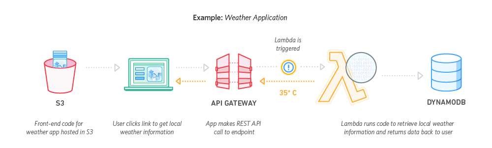
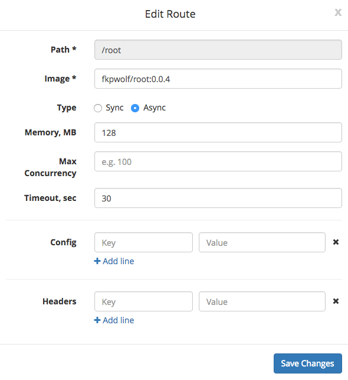
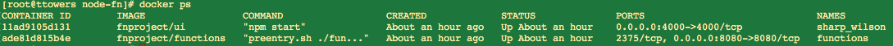
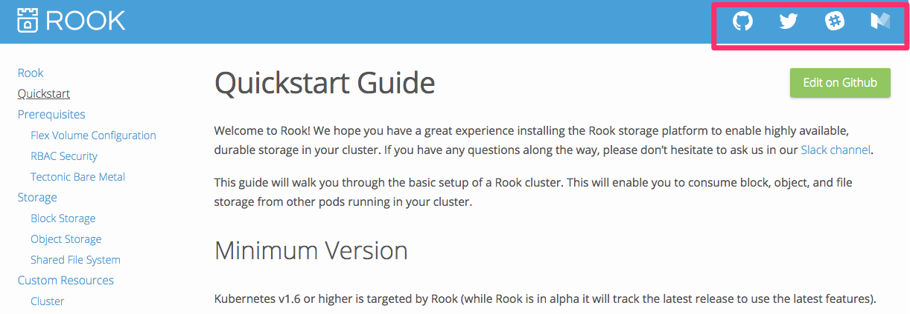
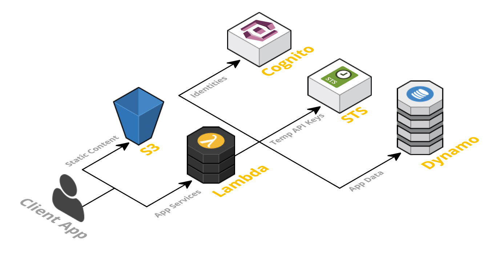
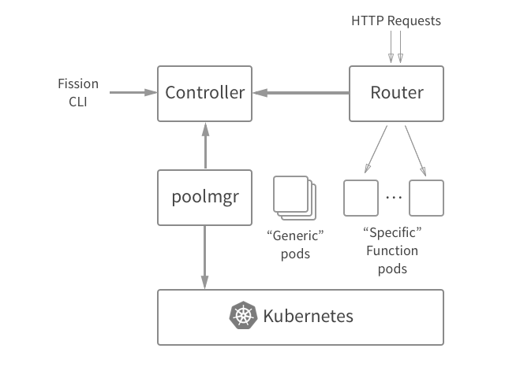
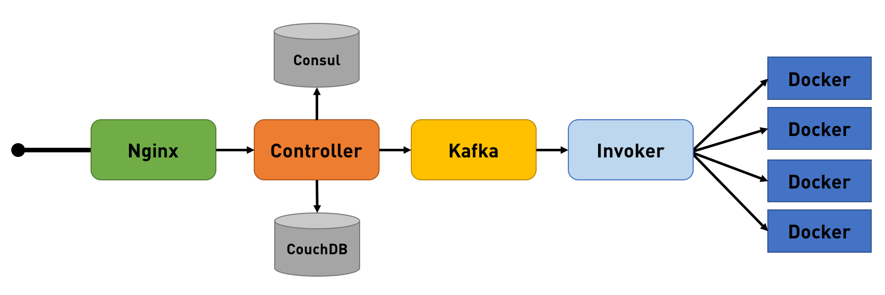
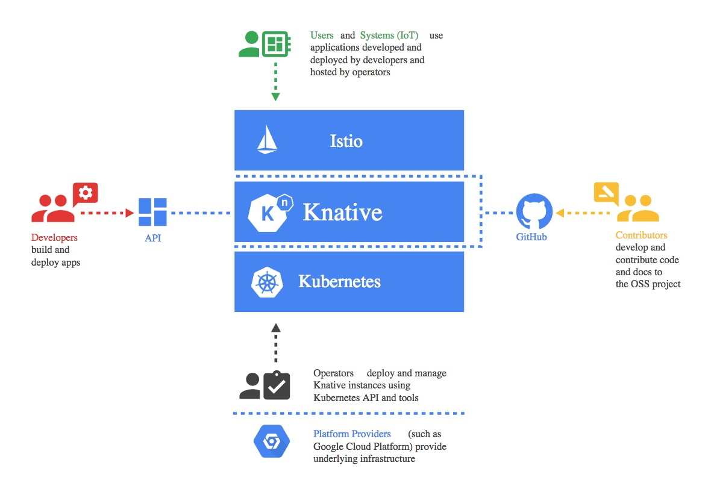

### 综述

[Serverless架构综述](http://dockone.io/article/1460),  

[FaaS、PaaS和无服务器体系结构的优势](http://www.infoq.com/cn/news/2016/06/faas-serverless-architecture), 

"大部分 PaaS 应用无法针对每个请求启动和停止整个应用程序，而FaaS平台生来就是为了实现这样的目的。”每次调用的时候才启动这个 Docker？这样对于性能的扩容倒是方便，而且对于云供应商来说更容易控制按次调用的收费模式，因为调用时才启动这个服务器，平时这个服务器是关闭的，所以叫做无服务器服务，或者功能即服务（Function-as-a-Service，FaaS）。 

并非 FaaS就是 serverless，serverless 把更多的业务移到客户端，然后尽量使用 BaaS 来完成认证等公用服务。 

[这个新闻](http://www.infoq.com/cn/news/2017/10/OracleFn)提到 Fn 目标在于 container-native，[大概来说](https://techcrunch.com/2016/04/27/lets-define-container-native/)，就是 container 直接运行在裸机而不是 VM 上面，我们现在过于关注编排工具比如 k8s 和运行环境比如 CoreOS，而 container 自身的问题比如 image 的安全验证就关注不多。 

常见的 FaaS：AWS Lambda，Spring Cloud Function <http://cloud.spring.io/spring-cloud-function/>  

<https://thepowerofserverless.info/> 界面做的不错 

无服务器架构（Serverless Architectures）<https://github.com/amio/serverless-zhcn> Mike Roberts 经典文章 

"如果你的 PaaS 能在 20ms 内启动一个只运行半秒钟的实例，它就叫 Serverless。” 

"FaaS 和 PaaS 在运维方面的关键区别是伸缩性（Scaling）。对于大多数 PaaS 平台而言你需要考虑如何伸缩，例如在 Heroku 上你要用到多少 Dyno 实例？对于 FaaS 应用这一步骤是完全透明的。即便你将 PaaS 配置为自动伸缩，也无法精细到单个请求级别，除非你有一个非常明确稳定的流量曲线可以针对性地配置。所以 FaaS 应用在成本方面要高效得多。” 

[资深CTO带来的8条Serverless最佳实践](http://www.techug.com/post/serverless-best-practices.html)

一个 function 应该只做一件事, 不让 function 调用其他 function, 尽可能少在 function 中使用额外的库, 避免使用基于连接的服务（少建立 RDBMS 连接）, 一个路由对应一个 function 

<https://aws.amazon.com/cn/dynamodb/> 这个客户端也不能直接访问啊，换成 mysql 也可以么，针对 Lambda 有什么特殊优化？ 



### Oracle Fn

<https://github.com/fnproject/fn> [Oracle](http://www.infoq.com/cn/news/2017/10/OracleFn) 的开源产品，Go 写的，hello world 也是 Go 写的。然后他运行在 Docker 上面，也有 yaml 文件，这个和 PaaS 不一样么？Deploy 的时候会 Pushing fkpwolf/root:0.0.3 to docker registry...The push refers to a repository [[docker.io/fkpwolf/root](http://docker.io/fkpwolf/root)]，然后没地方让我输入密码啊。原来要先使用 docker login 登录。但是这里我只是本地测试，为毛要 push 到 docker hub 上面？不过很小，才3MB。 

他还有个界面监控调用过程 <https://github.com/fnproject/ui> Vue 写的，cool，而且依赖也相当简洁，没有重量级的东西，UI 用 bootstrap，监控用的是轮询。一个小应用确实也应该这样简单。 



如果设置为 Async，则返回一个 call_id，后续可能根据这个 call_id 能获取返回值。Headers 是对返回的 HTTP Headers 进行定制。 

然后搞了个 func.js，里面就一句 console.log，deploy 后就可以访问了。一行代码 deploy，不需要 Dockerfile，这就是 Serverless 的全部？适合这种小片段的代码开发？PaaS 也是 Docker，这之间差别并不大啊。PaaS 不是 Docker 吧，PaaS 不仅提供运行时，而且提供各种服务。这个也可以访问其他服务吧。这个如何scale呢？有编排扩展？对接k8s应该是最合适了，已经有[文档](https://github.com/fnproject/fn/blob/master/docs/operating/kubernetes/README.md)。 

就起来了两个 Docker，真的是调用的时候才运行起来？这样是否会会有点慢？



总台来说这个 Oracle 的产品很容易上手，整个搭建过程体现了对 PaaS 平台易用性的改进。



这个网站右上角的功能都是其他网站提供的，也是 serverless 的一种形式。 

The Comprehensive Guide to Serverless Architecture <https://www.simform.com/serverless-architecture-guide/> 



k8s 能创建 fn 服务么？Fission <https://kubernetes.io/blog/2017/01/fission-serverless-functions-as-service-for-kubernetes/>



如果每次调用都起一个容器，速度太慢，如果直接运行代码，则依赖没法处理。Fission 采用了混合的办法，预先运行一些容器比如 Node.js & Python，然后让用户代码直接运行在这些容器上面。也可以自己定制运行时的容器。感觉和 cloud foundry 有点像，预先准备 runtime，不怎么纯粹啊。

### OpenWhisk



<http://dockone.io/article/2416> 这个底层是运行在 OpenShift 上面？否则简单的 Docker 没有集群啊。


<https://github.com/apache/incubator-openwhisk/blob/master/docs/about.md> CouchDB 只是用来存储结果？ 

整个项目是 Scala 写的，IBM 搞的，并发多么，为什么要 Scala 写？异步多，都是调用链。[核心 invoker 代码](https://github.com/apache/incubator-openwhisk/tree/master/core/invoker/src/main/scala/whisk/core/invoker)，似乎不复杂。

<https://github.com/apache/incubator-openwhisk/blob/master/docs/use_cases.md> 这使用场景万能啊 

<https://github.com/apache/incubator-openwhisk-deploy-kube/blob/master/README.md> 可以在 k8s 上面安装。折腾一番，居然把我集群搞挂了，k8s api 都不能访问。Java的东西就容易挂？我前面es搜索也是。设置 master 节点为不可调度： 

    kubectl taint nodes k8s-1 node-role.kubernetes.io/master=true:NoSchedule 

自己尝试了半天才找到这个命令，不知道对不对。再次安装，这次成功。没有看到 consul，但是有个 redis，替换了？invoker 是守护进程集，会在每个 node 上面创建一个。有两个任务：install-catalog & install-routemgmt。 
```
./wsk action create greeting greeting.js -i
./wsk action list -i
./wsk action invoke /guest/greeting --result -i
```
返回结果还算快。好奇其运行模式，在 k8s Pods 里面没有看到 node.js 相关的容器，确实如果每次运行都要创建一个 pods，开销有点大。ssh 到 invoker 所在工作节点上，docker ps 会看到 2 个 openwhisk/nodejs6action:latest 容器，正在运行中。仿照 [OpenWhisk Actions](https://github.com/apache/incubator-openwhisk/blob/master/docs/actions.md) 做了个 python 例子，发现只有在 invoke 时候才会创建新的容器。这个和上面的 Fission 差不多。Java 复杂点，要自己创建一个 jar 包，但这个 jar 包不用包含所有依赖 jar 比如基本的 gson，看来 runtime 会默认带一些。 

不考虑其性能和实现，从上面看，serverless 主要提供了快速运行一段逻辑代码的方法，所以 AWS Lambda 名字起的很贴切，确实只是一个函数。但是这个函数不仅可以快速发布和运行，而且可以扩展。 

### Knative

<http://www.infoq.com/cn/news/2018/07/knative-kubernetes-serverless> 谷歌发布Knative：用于构建、部署和管理Serverless工作负载的Kubernetes框架 『他首先说谷歌团队看到serverless在软件开发领域推动了两个方向的重要转变：运维模型和编程模型。serverless运维模型涉及到付费使用、扩展、安全补丁以及无维护。serverless编程模型则涉及到源驱动部署、微服务、可重用的原始组件以及事件驱动/反应模型。』



这个包含了 CI/CD 功能，能直接从源码到运行。 
* Build：从源到容器的构建编排； 
* Eventing：管理和交付事件； 
* Serving：请求驱动的计算，可以缩放到零。 

这个里面的 eventing 是作何意？ 

安装其例子 <https://github.com/knative/docs/blob/master/install/Knative-with-Minikube.md> + <https://github.com/knative/docs/blob/master/install/getting-started-knative-app.md> 跑一个了 hello world，直接部署一个 Build 好的 image，不带 CI/CD 功能。 
```yaml
apiVersion: serving.knative.dev/v1alpha1 # Current version of Knative
kind: Service
metadata:
  name: helloworld-go # The name of the app
  namespace: default # The namespace the app will use
spec:
  runLatest:
    configuration:
      revisionTemplate:
        spec:
          container:
            image: gcr.io/knative-samples/helloworld-go # The URL to the image of the app
            env:
            - name: TARGET # The environment variable printed out by the sample app
              value: "Go Sample v1”
```
这个也是 CRD，kubectl get crd 会返回一堆。创建的 pods 里面包含 3 个容器： 

1. user-container gcr.io/knative-samples/helloworld-go@sha256:98af3... 
2. queue-proxy gcr.io/knative-releases/github.com/knative/serving/cmd/queue@sha256:90a4... 
3. istio-proxy docker.io/istio/proxyv2:0.8.0 

后面的 hash 是做版本控制么？ 

第一次触发运行速度很快，后过一段时间，pod 会消失。再次触发，系统会重新生成一个，这次有明显延迟。这个就是“缩放至零”的效果？ 

触发运行的整个过程应该是： 

1. 获取 IP:NodePort，通过 istio-system namespace 中的 knative-ingressgateway service 定义。这个不是 istio 的官方 service 吧？ 
2. 通过 CRD 获取分配给 helloworld 的 hostname 
3. 通过 1 和 2 的结果来访问，istio 应该根据 hostname 做导向 
4. 导向到 knative，通过 event？knative 找到 deployment 对应的 CRD 数据，实时部署 pod。这个请求如何暂存如何在 pod 起来后转发是关键。

Istio 在这个里面做了路由的功能，但是并没有暴露给用户。 

上述例子也创建了一个 knative-build namespace，里面也有 webhook，但是没有使用。有空试试。
[GitHub的例子](https://github.com/knative/docs/tree/master/serving/samples/gitwebhook-go)，要有 GitLab的就好了。 

[serverless 平台 knative 简介](http://cizixs.com/2018/08/25/knative-serverless-platform) 写的比我的全面。 

### Nuclio - "Serverless" for Real-Time Events and Data Processing 

<https://github.com/nuclio/nuclio>

主要亮点在于 Real-time processing with minimal CPU and I/O overhead and maximum parallelism 

### Think

1. Serverless 如何使用、意义何在比其技术本身更为重要，这也是解决其请求延迟的关键。 
2. 这个和 CI/CD 结合很紧密