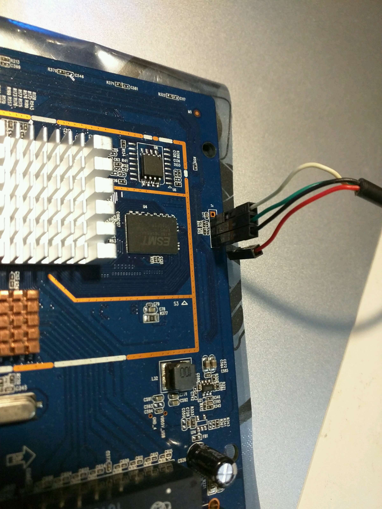

### 腾达 tenda AC15

百度贴吧 拆解 <http://tieba.baidu.com/p/4141027779> 
值友专享 <http://www.smzdm.com/p/745471>  
官网 <http://www.tenda.com.cn/product/AC15.html> V15.03.1.16_CN，USB传输只能用FAT32分区，读45MB/s。 
改NAND http://koolshare.cn/forum.php?mod=viewthread&tid=9326&extra=&authorid=18807&page=1 不过他要用NAND编程器，800￥。 
BCM4708大屌丝改机日记 <http://www.right.com.cn/forum/thread-183356-1-1.html>这里直接在SPI里面写NAND。 
DD-WRT生成的netgear.trx先加上US_AC15V1.0BR_V15.03.1.16_multi_TD01.bin的头，然后用fmk_099的crcalc更新CRC，这样就可以上传到tenda的原生固件里面。 
不过马上报错： 

```
VFS: Cannot open root device "mtdblock3" or unknown-block(0,0): error -6 
Please append a correct "root=" boot option; here are the available partitions: 
Kernel panic - not syncing: VFS: Unable to mount root fs on unknown-block(0,0) 
CPU1: stopping 
```
在cfe web ui里面上传netgear.trx（不用修改）后，也是一样的错误。这说明CFE或者flash里面就保存了falsh的分区表？可以用，可能是因为我前面的在stock firmwart flash dd失败了，nvram信息丢失了的缘故。Stock mtd layout: 
```
Creating 8 MTD partitions on "bcmsflash": 
0x000000000000-0x000001000000 : "All" 
0x000000000000-0x000000040000 : "Bootloader" 
0x000000040000-0x000000fc0000 : "KernelFS" 
0x0000001d8cdc-0x000000fc0000 : "RootFS" 
0x000000fc0000-0x000000fd0000 : "Policy" 
0x000000fd0000-0x000000fe0000 : "CFM_BACKUP" 
0x000000fe0000-0x000000ff0000 : "CFM" 
0x000000ff0000-0x000001000000 : "nvram" 
```
直接用小米的DD，可以用，但是web控制台速度会越来越慢(wifi链接，试试lan？）。wifi都很慢，才100mb，5g连上去更是没法用。移动硬盘加上去就马上挂掉。直接试试其他的SPI DD固件？ftp://ftp.dd-wrt.com/betas/ 可以在这里下载Tp-link archer C8的固件。4.4.4 kernel. cool! 

this commit(<https://github.com/fkpwolf/dd-wrt/commit/38ddf9cd23ee42e207d4d2f74d9b5cc8f27f11c0>) add support for c8. 但是还是没有看到哪里用了4.4的核心。移动硬盘还是会重启。 


### 腾达 AC9

<http://forum.anywlan.com/thread-393614-1-1.html> 拆机 BCM47189，也是Northstar系列 交换芯片：BCM53125 

same as <https://wikidevi.com/wiki/ASUS_RT-AC1200GP> asus提供了源码下载 <http://www.asus.com/Networking/RT-AC1200G-plus/HelpDesk_Download/> 不过内核还是2.6的。 

<https://www.dd-wrt.com/phpBB2/viewtopic.php?t=287041> WIP 

<https://forum.openwrt.org/viewtopic.php?id=65275> still no patch. Now it support AC9! Check <https://downloads.lede-project.org/releases/17.01.0-rc1/targets/bcm53xx/generic/> (still not backport to OpenWrt)I will try. 

后来发现 github 也可以搜索 commit 了：[https://github.com/lede-project/source/search?q=ac9&type=Commits&utf8=%E2%9C%93](https://github.com/lede-project/source/search?q=ac9&type=Commits&utf8=%E2%9C%93)，用起来更方便。 

TTL开始狂按ctl+c可以进入CFE console，可以打开cfe miniweb server。也会显示upgrade wait time is 3s，可能能用tftp直接刷机。 

cfe web直接上传asus trx固件，The file transferred is not a valid firmware image.日啊。需要asus的cfe boot loader？ 

使用上面的LEDE固件，只能在cfe里面刷。看来lede做了特殊的处理了。 

刷好后，启动成功。系统自带luci。只能看到一个wifi，enable it，PC 无法扫描到。 

白线：RX，绿线：TX



### WDR7500 v3

 <http://wiki.openwrt.org/toh/tp-link/tl-wdr7500> QCA9558(SOC) + QCA9880(5G) + AR8327N. There are different versions. WDR7500 v3 = archer C7 V2. 

programmer fw <http://www.right.com.cn/forum/thread-145112-1-1.html>  

tear down <http://bbs.mydigit.cn/read.php?tid=877688>  

use u-boot-qca9558-ar8327n.bin. 

5G not work, as [this thread](https://forum.openwrt.org/viewtopic.php?id=44201&p=20) talked. But [here](http://tieba.baidu.com/p/3134563407) one specified for WDR7500 V3 is working(5G very slow). So is the official FW for Archer C7 v2 different with WDR7500?  

<https://dev.openwrt.org/ticket/16589>  

Flash [this](http://www.right.com.cn/forum/thread-153874-1-1.html) ART file then 5G ok. Why the specified fw works without new ART file? shit. 

For IPTV, looks changeset([1](https://dev.openwrt.org/changeset/42653), [2](https://dev.openwrt.org/changeset/42652)) has been applied already. So IPTV was working without code changes. And most code was moved to CC/target/linux/generic/files/drivers/net/phy/ar8327.c. BB didn't contain it? To make changes, just edit vi ./build_dir/target-mips_34kc_uClibc-0.9.33.2/linux-ar71xx_generic/linux-3.18.7/drivers/net/phy/ar8327.c.  

After testing, CC can add 2 vlan on same port, but one(51) is tagged, one(85) is not. Looks sw_get_ports make this happened. 

VLAN 51: 

​        vid: 51 

​        ports: 1t 4t 

VLAN 85: 

​        vid: 85 

​        ports: 1t 4 

Shit. Turn to BB and use my ar8216.c(BB file has same issue:WAN can't get ip. clue???) file and IPTV works again. 

5G. BB need use below to get 800Mps: 

   uci set wireless.radio0.htmode=VHT80 

   uci commit 

   wifi 

When do copying, speed is fast but not stable. 5G of CC is more stable. 

[BB]ping 163.com sometimes is very big(300ms) after 2 or 3 days(after use 5G wifi?).  

log has : 

[24813.600000] nf_conntrack: automatic helper assignment is deprecated and it will be removed soon. Use the iptables CT target to attach helpers instead. 

[52994.560000] ath: phy1: Failed to stop TX DMA, queues=0x002! 

Restart WAN can go to normal speed(5ms). Sometimes I didn't find the error but still need to restart WAN. Looks it is a known issue <http://svn.dd-wrt.com/ticket/2952> <https://dev.openwrt.org/ticket/11862>  

最近发现小米手机无法自动连接这个路由，试试 lede 的 [archer-c7-v2-squashfs-factory.bin](http://downloads.lede-project.org/releases/17.01.3/targets/ar71xx/generic/lede-17.01.3-ar71xx-generic-archer-c7-v2-squashfs-factory.bin)，刷后感觉和openwrt一样啊，就软件新版本会新点。 


### MAC1200R 

AR9344  9882  主芯片AR9344(same with 4530R)+AR9882   8m  flash  128M内存  

AR9344: Full IEEE 802.1Q VLAN ID processing per port and VLAN tagging for 4096 VLAN IDs; and port based VLANs supported 

Download uboot("u-boot-ar9344.bin") from [this topic](http://www.right.com.cn/forum/forum.php?mod=viewthread&amp;amp;amp;amp;tid=136444) and use it's way to flash uboot in uboot/ttl. To goto recovery mode, need special step(check the topic). 

路由器拔掉所有网线，仅在 LAN 口上保留一根网线，跟电脑相连。只有一个网口的路由请直接连接。 

按住 RESET 按钮或 WPS 按钮，并通电，等到所有 LED 闪烁 (可能不同步) 4Hz * 1s 次后，再等待 3-4 秒，就进入刷机模式了。直接访问 192.168.1.1 即可，不再需要修改 IP 地址！ 

~4M firmware [http://www.right.com.cn/forum/forum.php?mod=viewthread&tid=142477](http://www.right.com.cn/forum/forum.php?mod=viewthread&amp;amp;amp;amp;tid=142477) 

[http://www.right.com.cn/forum/forum.php?mod=viewthread&tid=142547](http://www.right.com.cn/forum/forum.php?mod=viewthread&amp;amp;amp;amp;tid=142547) provide ART. After flash ART, I can't see wifi again.  

u-boot <http://www.right.com.cn/forum/thread-147651-1-1.html>  

Here provide [patch](http://www.right.com.cn/forum/forum.php?mod=viewthread&tid=147372) (need make dirclean after apply the patch, or just make target/linux/clean?) for MAC1200R/WDR6300. Flash new u-boot, and flash wdr6300 built by me with the patch. Can’t boot, same even I flashed mw-4530r. flash layout wrong? No. eth0 is not up. TTL say "ag71xx ag71xx.0: no PHY found with phy_mask=00000001". Because 4530R use different phy. 

But then still can't enable 5G. 

[   12.330000] ath10k_pci 0000:00:00.0: Falling back to user helper 

procd: Could not find firmware  

[   12.390000] ath10k_pci 0000:00:00.0: could not fetch firmware file 'ath10k/QCA988X/hw2.0/firmware-3.bin': -2 

lib/firmware/ath10k/QCA988X/hw2.0/firmware-3.bin 

[   12.650000] ath10k_pci 0000:00:00.0: otp stream is empty, using board.bin contents 

--> to fix it, just disable "Firmware optimized for STA operation". 

IPTV 

config interface 'wan' 

​        option ifname 'eth1' 

​        option proto 'dhcp' 

config switch 

​        option name 'switch0' 

​        option reset '1' 

​        option enable_vlan '1' 

config switch_vlan 

​        option device 'switch0' 

​        option vlan '1' 

​        option ports '0 1 2 3 4' 

driver ./target/linux/ar71xx/files/drivers/net/ethernet/atheros/ag71xx/ag71xx_ar7240.c, MAX VLANS =16. Modify to 128. make target/linux/clean. Then I can use VLAN 83. 

### MW4530R 

双频(750M)千兆无线路由器，硬件配置与TP-Link WDR4310/4300一致： 

CPU:  Atheros AR9344@560MHz  (MIPS 74Kc)  (SOC) 

Flash:Spansion FL064KIF @8MB 

RAM:H5PS5162GFR*2 @128MB 

Ethernet Switch:Atheros AR8327N Gigabit Switch(<https://wikidevi.com/files/Atheros/specsheets/AR8327_AR8327N.pdf>) 

Wireless 1: Atheros AR9340 2.4ghz 802.11bgn(in CPU) 

Wireless 2:Atheros AR9580 5ghz 802.11an 

<http://wiki.openwrt.org/toh/mercury/mw4530r>

how connect to chip? PCI-E? 

使用原厂固件打开硬件NAT后，[TCP速度](http://www.right.com.cn/forum/thread-116041-1-1.html)提高三倍。现阶段官方openwrt还不支持硬件NAT。 

刷不死UBOOT <http://www.right.com.cn/forum/thread-100259-1-1.html> 

更高级的uboot <http://www.right.com.cn/forum/thread-136444-1-1.html> 刷uboot方法 [http://www.right.com.cn/forum/thread-1476 51-1-1.html](http://www.right.com.cn/forum/thread-147651-1-1.html)  

haxc的openwrt，带luci <http://www.right.com.cn/forum/thread-102073-1-1.html> 

如何刷官方的 [http://www.right.com.cn/forum/forum.php?mod=viewthread&tid=130285](http://www.right.com.cn/forum/forum.php?mod=viewthread&amp;amp;amp;amp;amp;amp;tid=130285) 

5G远点就不能连的问题：改地区为CN，信道为自动（实际为149. 官方5GHz信道选择：149、153、157、161、165）。不用改无线电功率。"看到5g的射频放大芯片是se5005l。查了datasheet，在3.6v的工作电压下最大输出18dbm，大概就是50mw。" 

添加option noscan '1'，HT模式 要设置为40+ -，无线可以上300m。无线发射功率默认为100mW。 

连接我的2.5寸移动硬盘：硬盘不能启动，一直“卡卡”。我猜是电源问题。为什么小度路由就没有问题？ 

IPTV 

G300NH 用交换机硬件处理 FTTH IPTV VLAN的方法  [http://www.chinadsl.net/forum.php?mod=viewthread&tid=66913](http://www.chinadsl.net/forum.php?mod=viewthread&amp;amp;amp;amp;amp;amp;tid=66913) 

LINKSYS E3000刷DDWRT修改内核无线，有线上网，IPTV完美支持<http://www.chiphell.com/thread-442136-1-1.html> 

 RT-N16  http://www.chinadsl.net/forum.php?mod=redirect&goto=findpost&ptid=64551&pid=438679 

<http://wiki.openwrt.org/doc/uci/network/switch>

http://www.chinadsl.net/forum.php?mod=redirect&goto=findpost&ptid=66913&pid=495797 

 这个有成功点播，但是其他都不行。 

<https://forum.openwrt.org/viewtopic.php?id=33058>

<http://www.right.com.cn/forum/thread-134269-1-1.html> 要改内核代码么？晕啊。 

有patch已经fix这个问题 <https://dev.openwrt.org/ticket/12181>.  [Here](https://dev.openwrt.org/ticket/12181#comment:52) is How to apply patch. Maybe clean is necessary before build. 

Last VLAN config file  

swconfig dev switch0 show 

option proto 'pppoe' 

option password 'esjihyAF' 

option username '18964945712' 

性能 

在新路由上面ping baidu.com（星期四晚上10点），结果为 

最短 = 28ms，最长 = 30ms，平均 = 29ms 

老的电信路由： 

最短 = 33ms，最长 = 35ms，平均 = 34ms 

公司网络： 

Minimum = 36ms, Maximum = 89ms, Average = 49ms 

MW4530R + Odroid U3, cable connect, RMBP has 8MB/s download from h5ai. With Raspberry, 6.5MB/s. 

directly connect with USB, only 5.5MB/s. 

移动硬盘 

<http://wiki.openwrt.org/zh-cn/doc/howto/usb.storage>

挂载U盘时候，说kernel版本不一致。我的旧，重新编译核心？ 

加上kernel module编译后，手工安装package.ipk还是不行，kernel这个package大版本没有变，小版本却变了。 

kmod-usb-storage 

kmod-fs-ext4 

luci-hd-idle 

luci-app-samba 

all marked as * 

hd-idle didn't work(error when run hd-idle in console). I changed to hdparm by installing this package. When run it, also got error. Not sure it works or not. 

root@OpenWrt:~# hdparm -S 100 /dev/sda 

/dev/sda: 

setting standby to 100 (8 minutes + 20 seconds) 

SG_IO: bad/missing sense data, sb[]: 72 01 00 1d 00 00 00 0a 09 0c 00 00 00 64 00 00 00 00 00 00 00 00 00 00 00 00 00 00 00 00 00 00 

4530折腾小记（改5天线，修改USB供电，双闪存，引出TTL，CPU散热） 

[http://www.right.com.cn/forum/forum.php?mod=viewthread&tid=128129](http://www.right.com.cn/forum/forum.php?mod=viewthread&amp;amp;amp;amp;amp;amp;tid=128129)

./target/linux/ar71xx/image/Makefile:$(eval $(call SingleProfile,TPLINK-LZMA,64kraw,MW4530RV1,mw4530r-v1,TL-WDR4300,ttyS0,115200,0x45300001,1,8Mlzma)) 

2014.中秋 换16M flash。先换SOP16，失败。换普通16M flash，刷16M编程器固件，OK。刷自己8M固件，不能启动。开始反复刷机/拆flash。其中UART时好时坏。机器也有时能启动，有时不能启动。能启动时，取不到IP。怀疑flash小电阻已坏，清洗电路板，准备测量电阻，这时候一切正常。 

Wifi 

Sometimes wifi(2.5G) can't start. System.log say: 
```
Sun Mar 30 10:10:04 2014 kern.info kernel: [ 20.030000] device wlan0 entered promiscuous mode 
Sun Mar 30 10:10:04 2014 kern.info kernel: [ 20.030000] br-lan: port 2(wlan0) entered forwarding state 
Sun Mar 30 10:10:04 2014 kern.info kernel: [ 20.040000] br-lan: port 2(wlan0) entered forwarding state 
Sun Mar 30 10:10:04 2014 daemon.notice netifd: radio0 (864): Segmentation fault (core dumped) 
Sun Mar 30 10:10:04 2014 daemon.notice netifd: radio0 (864): cat: can't open '/var/run/wifi-phy0.pid': No such file or directory 
Sun Mar 30 10:10:04 2014 kern.info kernel: [ 20.070000] br-lan: port 2(wlan0) entered disabled state 
Sun Mar 30 10:10:04 2014 kern.info kernel: [ 20.080000] cfg80211: Calling CRDA for country: US 
Sun Mar 30 10:10:04 2014 kern.info kernel: [ 20.120000] cfg80211: Regulatory domain changed to country: US 
Sun Mar 30 10:10:04 2014 kern.info kernel: [ 20.120000] cfg80211: DFS Master region: FCC 
....... 
Sun Mar 30 10:10:05 2014 daemon.notice netifd: radio0 (864): Command failed: Invalid argument 
Sun Mar 30 10:10:05 2014 daemon.notice netifd: radio0 (864): Device setup failed: HOSTAPD_START_FAILED 
Sun Mar 30 10:10:05 2014 kern.info kernel: [ 20.630000] br-lan: port 2(wlan0) entered disabled state 
```
It is an [existing](https://forum.openwrt.org/viewtopic.php?id=48224) issue. I ran "wifi up" in ssh console. Then ok. 

wifi is slow. Looks I have enable "HT mode" to "40MHz 2nd channel above". But then 2.5G can't use this setting otherwise it can't startup. For macbook pro osx 5G & close distance, it show "450" Mbps. Desktop show 270Mbps(300M with Realtek 8812AU). Macbook at sleep room show 162M TOO!!! 


### WNDR4500 

https://wikidevi.com/wiki/Netgear_WNDR4500v1 BCM4706+BCM53115 

unbox http://www.right.com.cn/forum/forum.php?mod=viewthread&tid=133551 

TT http://www.right.com.cn/forum/thread-126746-1-1.html 

Linux version 3.10.55-rc1 (bluebat@linux-vm-os64) (gcc version 4.7.3 20121001 (prerelease) (Linaro GCC 4.7-2012.10) ) #82 Tue Sep 16 21:29:44 CEST 2014 

So would use dd-wrt-toolchain/toolchain-mipsel_r2_gcc-4.7-linaro_uClibc-0.9.33.2. 

use Makefile.brcm3x 

/mnt/2t/dd-wrt-toolchain/toolchain-mipsel_r2_gcc-4.7-linaro_uClibc-0.9.33.2/bin/../lib/gcc/mipsel-openwrt-linux-uclibc/4.7.3/cc1: error while loading shared libraries: libcloog.so.0: cannot open shared object file: No such file or directory 

==> use openwrt/staging_dir/toolchain-mipsel_24kec+dsp_gcc-4.8-linaro_uClibc-0.9.33.2 

dmesg has "something wrong here. do not remap". 

samba copy: usb, hard disk PLC, windows 8.1,  7.6MB/S, big file. But can't use hdparm to control it. Hard disk can sleep automatically. 

For IPTV, some as miwifi. BUT, Looks I have to use 0 port!!! Otherwise if I do "/sbin/vconfig add eth0 51", got error "vconfig  failed: ifconfig: ioctl 0x8913 failed: No such device". 
```
root@DD-WRT:/jffs# cat iptv.sh 
/sbin/rmmod switch_robo 
/sbin/insmod /jffs/switch-robo.ko 
/bin/sleep 5 
/bin/echo "4t 0" >/proc/switch/eth0/vlan/51/ports 
/sbin/vconfig add eth0 51 
/sbin/ifconfig vlan51 up 
/bin/echo "4t 0" >/proc/switch/eth0/vlan/85/ports 
/sbin/vconfig add eth0 85 
/sbin/ifconfig vlan85 up 
Then add "/bin/sh /jffs/iptv.sh" as start-up command. 
```
### 703N

<http://wiki.openwrt.org/toh/tp-link/tl-wr703n>

<http://wiki.openwrt.org/doc/hardware/cpu> MIPS cpu 

install <http://geek-workshop.com/thread-2418-1-1.html> 

upgrade hardware: <http://blog.sina.com.cn/s/blog_64d0b03c0101hfn0.html> 

有次没安装LUCI（我标记成M，其实要标记成*），刷机后没办法再次刷机。uboot没带httpd，据说http太慢。只能修改/etc/config/network，通过DHCP接到其他路由器上，但这时候可能因为防火墙，不能直接ssh到703n。只能先连上703n的无线网络，然后ssh 192.168.1.1上去。再安装luci。 

opkg update 

opkg install luci 

/etc/init.d/uhttpd enable 

/etc/init.d/uhttpd start 

山寨Arduino Yun [http://www.right.com.cn/forum/forum.php?mod=viewthread&tid=142416](http://www.right.com.cn/forum/forum.php?mod=viewthread&amp;tid=142416) 

To use usb disk, install "kmod-usb-storage". Need install kmod-fs-* modules. To detect file system type, use "blkid" command. 

root@OpenWrt:~# mount -t ext4 /dev/sda2 /mnt/usb 

mount: mounting /dev/sda2 on /mnt/usb failed: No such device 

This just need a reboot. 

### 斐讯FWR706

可用的几个编程器备份 [http://www.right.com.cn/forum/forum.php?mod=viewthread&tid=135006](http://www.right.com.cn/forum/forum.php?mod=viewthread&amp;amp;amp;amp;tid=135006) 

nvram set wait_time=10, nvram commit(boot_wait was on already) 

 斐讯FWR706磊科NW236编程器固件 

http://forum.anywlan.com/forum.php?mod=viewthread&tid=260129&extra=&authorid=315267&page=1  

登录密码为guest:guest。这个路由器有两个WAN，所以LAN1口是不能用的。好像CFE还是不能WEB刷机。 

使用flash命令强制刷机 flash -noheader 192.168.1.3:vmlinuz flash1.trx 

http://www.right.com.cn/forum/forum.php?mod=viewthread&tid=150409&highlight=706  

斐讯706刷机教程 [http://www.anywlan.com/forum.php?mod=viewthread&tid=289293](http://www.anywlan.com/forum.php?mod=viewthread&amp;amp;amp;amp;tid=289293) 

Don't know why flash hi-spider at first. If tftp didn't work: 1)close firewall; 2)disable other network interface;3)try another tftp version; 4) after eth connected then open tftp. As the guid said, after flash DD, router keep restarting. My step is: press RESET and poweron, not work, try again, unplug power, try again. Work. Shit! 

system type             : Broadcom BCMD144 chip rev 1 "BCM53572 " 

Build DD 

discard local changeset "svn revert --recursive ." 

export PATH=~/dd-wrt-toolchains/toolchain-mipsel_gcc4.1.2/bin:$PATH

export PATH=~/dd-wrt-toolchains/toolchain-mipsel_r2_gcc-4.6-linaro_uClibc-0.9.33/bin:$PATH

cp configs/broadcom_K3x/.config_mini.v24-K26 .config 

make -f Makefile.brcm26 configure 

Build Openwrt 

Choose Broadcom BCM47xx/53xx, MIPS 74k. Easy, but no wifi, even there is wifi menu in menuconfig. Looks it use [closed](https://forum.openwrt.org/viewtopic.php?id=48657) source. 

Someone tried it looks wifi works now?([http://www.right.com.cn/forum/forum.php?mod=viewthread&tid=150601](http://www.right.com.cn/forum/forum.php?mod=viewthread&tid=150601)  ) 

<http://infodepot.wikia.com/wiki/TJTAG> looks support BCM5357. 

### RT5350/dostyle wifi

VoCore <https://wikidevi.com/wiki/VoCore>   

u-boot http://forum.vocore.io/viewtopic.php?t=85&p=645  

It use EM63A165TS-6G(32MB) 

32MB http://www.etron.com/manager/uploads/EM63A165TS_v1.4.pdf  

703N can use DDR HY5DU121622DTP 64MB. Can't this one use DDR?  

Can't. Fxxk! http://www.right.com.cn/forum/forum.php?mod=viewthread&action=printable&tid=126340  

16M flash patch <http://vonger.cn/wp-content/uploads/2014/12/vocore.txt>  

For 32M memory, looks need change hardware! <http://www.right.com.cn/forum/thread-120311-1-1.html>  

work for 32M by this topic <http://www.right.com.cn/forum/thread-127794-1-1.html> [https://forum.openwrt.org/viewtopic.php?id=37002&p=25](https://forum.openwrt.org/viewtopic.php?id=37002&p=25)  

Use script <http://wiki.openwrt.org/doc/devel/add.new.device>, it's reset button is GPIO0. 

Chaos Calmer was slow for this device. Always “collect data…”. If I open Dev Tool and select "Disable cache (while DevTools is open)", then load quickly. Update to snapshot OpenWrt Designated Driver r48564 and became faster. 

The only one LAN is on port 0. So if I want LAN port to be WAN, network config is: 
```
config interface 'wan'
        option ifname 'eth0.2'
        option proto 'dhcp'
config switch_vlan
        option device 'switch0'
        option vlan '1'
        option ports '6t'
config switch_vlan
        option device 'switch0'
        option vlan '2'
        option ports '0 6t'
```
USB. Add a USB wifi usb, no message. Then install 'usbutils' and run 'lsusb'. Got 'unable to initialize libusb: -99'. Then I installed 'kmod-usb-ohci' & 'kmod-usb-uhci' and 'kmod-usb2' and then can find the usb adapter.  Run 'wifi defect' as this topic <https://wiki.openwrt.org/doc/uci/wireless#regenerate_configuration> then router brick!!!  can't connect again. Attach TTL. Try to write un-dead uboot from here <https://github.com/noblepepper/ralink_sdk/releases> . Stock uboot can't be interrupted when booting. In openwrt ssh, mtd -r write uboot.img uboot. Say can't write uboot partition. Then change to fw by the same site of uboot. Can write uboot. But then I found it need GPIO0 HIGH 3 sec then release(LOW). My device is HIGH default. Server ip is 10.10.10.123. 


### WHR-HP-G300N 

 <http://wikidevi.com/wiki/Buffalo_WHR-HP-G300N> 

从[这个](http://itbbs.pconline.com.cn/network/15121438.html)看内存是w9425g6jh-5的DDR内存, winbond的[ddr sdram](http://www.winbond.com/hq/enu/ProductAndSales/ProductLines/SpecialtyDRAM/DDRSDRAM/)最高只有32M. 

三星的有[这样的](http://www.samsung.com/global/business/semiconductor/product/consumer-dram/catalogue?iaId=913)64M内存，taobao上面K4H511638J和K4H510838J比较多。 

要改UBOOT么？ 

<http://wiki.openwrt.org/toh/buffalo/whr-hp-g300n>

Memory Mira P3S56D40ETP-G5 <http://www.sbit.com.tw/en/productsearch.aspx?_searchtext=P3S56D40ETP-G5>  

### NW752

闪存8M,内存64M,芯片为Broadcom 5358u（500MHz） 

http://www.right.com.cn/forum/forum.php?mod=viewthread&tid=131968&highlight=NW752 

A try to flash. 

source code <http://tomato.groov.pl/?page_id=166>  

bwq518's firmware <http://tt.onv.cc/?lang=zh>  

My topic <http://www.right.com.cn/forum/thread-157981-1-1.html>  

device list of BCM5358UB0. Similar with Asus RT-N53, it's Tomota fw [addr](http://tomato.groov.pl/download/K26RT-N/build5x-124-EN/Asus%20RT-Nxx/). Directly flash in stock firmware. Then ok. Note the WAN was changed to LAN1. As below screenshot. 2.4G work. 5G not. 

Download tomato code and run "git checkout remotes/origin/tomato-shibby-RT-N". In code release/src/router/rc/init.c, maybe I can set some nvram value. If I set boradnum & boradtype to value of N53, router can't boot. Reset. Then I follow the logic when id is N53: 
```
root@unknown:/tmp/home/root# nvram get usb_storage 
1 
root@unknown:/tmp/home/root# nvram set usb_storage=-1 
---> Then usb_core was removed from lsmod 
root@unknown:/tmp/home/root# nvram get lan_ifnames 
vlan1 eth1 
root@unknown:/tmp/home/root# nvram set lan_ifnames="vlan1 eth1 eth2" 
root@unknown:/tmp/home/root# nvram get landevs 
vlan1 wl0 wl1 
root@unknown:/tmp/home/root# nvram get wl1_ifname 
root@unknown:/tmp/home/root# nvram set wl1_ifname=eth2 
```
Then 5G work. If I flash "*mega.trx", 5g not work. The RED words was missed. 

ehci_hcd: USB 2.0 'Enhanced' Host Controller (EHCI) Driver 

PCI: Setting latency timer of device 0000:00:04.1 to 64 

ehci_hcd 0000:00:04.1: EHCI Host Controller 

ehci_hcd 0000:00:04.1: new USB bus registered, assigned bus number 1 

ehci_hcd 0000:00:04.1: EHCI Fastpath: New EHCI driver starting 

ehci_hcd 0000:00:04.1: irq 5, io mem 0x18004000 

ehci_hcd 0000:00:04.1: USB 0.0 started, EHCI 1.00 

usb usb1: configuration #1 chosen from 1 choice 

hub 1-0:1.0: USB hub found 

hub 1-0:1.0: 2 ports detected 

usb 1-2: new high speed USB device using ehci_hcd and address 2 

usb 1-2: configuration #1 chosen from 1 choice 

bcm_rpc_up: waiting to be connected (release/src-rt/shared/bcm_rpc.c, but who call it?) 

bcm_rpc_buf_recv_mgn_high: Reason: 0 Dongle Version: 0x5648a89

bcm_rpc_buf_recv_mgn_high: Connected!

eth2: Broadcom BCMa8e4 802.11 Wireless Controller 5.100.138.20

usbcore: registered new interface driver dbus_usbdev

vlan1: add 33:33:00:00:00:01 mcast address to master interface 

./release/src/router/rc/usb.c:#ifdef TCONFIG_USBAP  

Then in src/Makefile, I found mega profile hasn't USBAP=y, but N53 has. And this value would make TCONFIG_USBAP be no. TCONFIG_USBAP is a pre-compile micro so can't change in runtime. I change Mega profile and add USBAP=y. Can't boot after flash. Flash N53 built by me. Working. The stamp in dmesg is "root@tomato". To change it, modify src-rt/linux/linux-2.6/vi scripts/mkcompile_h. It will generate the stamp in file linux/linux-2.6/include/linux/compile.h. 

To build it, need go to release/src-rt, run "make help". 

Last firmware is at tomato/release/src-rt/image. 

filesystem looks is read-only. 

"400 Bad Request - Your client has issued a malformed or illegal request." Change to Firefox then ok. Clear cookie also work. So tomato web ui used too much cookie(and localStorage)? 

Vlan port change 

vlan1ports=1 2 3 4 5* 

vlan2ports=0 5 

root@nw752-tomato:/tmp/home/root# nvram get vlan1ports 

0 1 2 3 5* 

root@nw752-tomato:/tmp/home/root# nvram get vlan2ports 

4 5 

"VLAN ID is equal to vlan number, max 16 vlans" in release/src-rt/et/sys/etc_adm.c 

copy a kvm file : ethernet 11M/s, 5G 5M/s, 2.5G 3M/s. 2.5G wifi was connected as "150Mbps". When copy kvm, open "Mothly/weekly usage", router will reboot. 

Looks the CFE Web only open for 2 or 1 second. To clear nvram, open "http://192.168.1.1/do.htm?cmd=nvram+erase" and keep be refreshing. Use dhcp to get ip. To upload firmware, maybe need tftp and push quickly. This happen only when device reboot abnormally? 

to use PPTP, I have been able to establish the connection using 128-bit only for encryption and Stateless MPPE thing enables. Now log didn't report error. But still can't access twitter.com.  

### Netgear WNR3500 v2

<https://wikidevi.com/wiki/Netgear_WNR3500v2>  

<http://bbs.mydigit.cn/read.php?tid=315437> 拆解 


Have to flash DD before Tomato. Check this <http://www.dd-wrt.com/phpBB2/viewtopic.php?p=721643> Only dd-wrt.v24-14896_NEWD-2_K2.6_mini-WNR3500v2.chk work. Least version will not. If router semi-brick, use tftp to put a chk file to router. After flash tomato, need 30-30-30. 

32M=>64M: http://www.right.com.cn/forum/forum.php?mod=viewthread&action=printable&tid=53884 new cfe here. 

how to flash cfe <http://dd-wrt.com/wiki/index.php/CFE_backup#by_telnet.2FSSH_2> or <http://bbs.dualwan.cn/archiver/?tid-52332.html>  

After flash cfe, need set nvram as this thread. [永久修改 DD-WRT/Tomato 固件中的 MAC 地址](http://itbbs.pconline.com.cn/network/12156914.html)  

16M flash <http://racede.me/wnr3500v2-cfe-system-upgrade.html> not necessary. Just change. 

tomatousb is too old(EOL). Try <http://tomato.groov.pl/download/K26/build5x-128-EN/>  but it say "File is too big to fit in MTD". Change 16M flash. not need to flash cfe(but mac lost?). flash tomato-K26-1.28.RT-MIPSR2-128-Max.trx. OK. Can't flash tomato-K26USB-1.28.RT-MIPSR2-128-Mega-VPN.trx. 

Unbrick  <http://www.myopenrouter.com/gallery/13865/Gallery-How-To-Debrick-Your-NETGEAR-WNR3500L-Using-A-USB-TTL-Cable-on-Windows/> <http://www.myopenrouter.com/article/20501/Reset-Debrick-NETGEAR-WNR3500L-Pin-Short-Method/>  

overlock 

root@unknown:/tmp/home/root# nvram get clkfreq 

453,226,113 

<http://www.myopenrouter.com/forum/thread/25537/Right-CPU-frequency/>  

disable WIFI, only 3W power. But looks the tomato didn't support vlan > 16. 

<http://www.right.com.cn/forum/thread-81507-1-1.html> WNR3500L半砖修复心得 

Attach UART, found cfe stopping here: 

Reading :: Done. 3448890 bytes read 

Reading ::

Still wait for something? or check sum error? Same issue as this topic. Then I found I have to use WNR3500L stock firmware because I have flashed a WNR3500L CFE.  <https://wikidevi.com/wiki/Netgear_WNR3500Lv1> v2版是nand的flash。 

dd-wrt K3 flash [way](http://www.dd-wrt.com/phpBB2/viewtopic.php?p=898392). I failed. After I flash dd K2, then flash K3.bin, get below error after reboot: 

Checksum mismatch: 

Image chksum: 0xB585A6E7 

Calc  chksum: 0x02C0010E 

Boot program checksum is invalid 

Start TFTP server 

Reading :: 

If I flash K3.trx by CFE TFTP, can't flash. 

router has 3x3 MIMO and 3 IPX ports. 

K3 DD-wrt <ftp://ftp.dd-wrt.com/betas/2015/06-05-2015-r27240/broadcom_K3X/>  

add USB port [http://www.right.com.cn/forum/forum.php?mod=viewthread&tid=45185](http://www.right.com.cn/forum/forum.php?mod=viewthread&tid=45185)  

刚发现openwrt已经支持这个路由器，哈哈。 

<https://downloads.openwrt.org/chaos_calmer/15.05.1/brcm47xx/mips74k/openwrt-15.05.1-brcm47xx-mips74k-netgear-wnr3500l-v1-north-america-squashfs.chk> 这个可以用（还有一个是非74k的，软件更多），带luci。wifi也可以用，openwrt威武。 

### BL-600N

<http://www.right.com.cn/forum/thread-180594-1-1.html>  

<https://wikidevi.com/wiki/Tenda_N60>  

先到www.tenda.com.cn搜索N60，刷成腾达的。然后直接刷 tomato <https://advancedtomato.com/downloads/router/n60> 。但是WAN-LAN只有20MB/s。刷回N60官方固件，也只有13MB/s。奇怪。要清nvram重新测试么？ 运行"modprobe bcm_nat"后，速度可以到24MB/s。据说这样后，QOS就不能使用了。 

现在的问题是性能还可以，就是发热量大了点。不过关掉两个WIFI后温度将了很多。 

然后我想也刷成openwrt，用上面wnr3500l同样的chk，tt里面可以刷机，但是重启后停在cfe web。难道要换cfe先？ 
```
Device eth0:  hwaddr 44-33-4C-94-5B-88, ipaddr 192.168.1.1, mask 255.255.255.0 
​        gateway not set, nameserver not set 
Loader:raw Filesys:tftp Dev:eth0 File:192.168.16.123:vmlinuz Options:(null) 
Loading: Failed. 
Could not load 192.168.16.123:vmlinuz: Timeout occured 
```
tftp没法加载固件。因为IP段不同？ 

### Think

为啥搞这么多路由器呢？还不包括重点搞的路由。深思中。


```

```